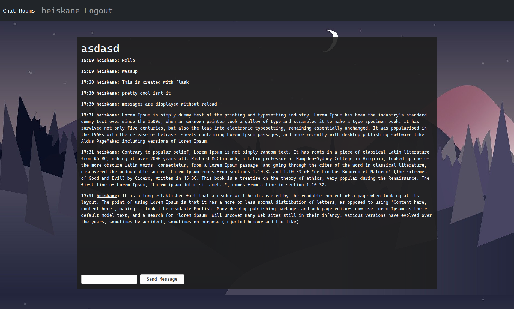
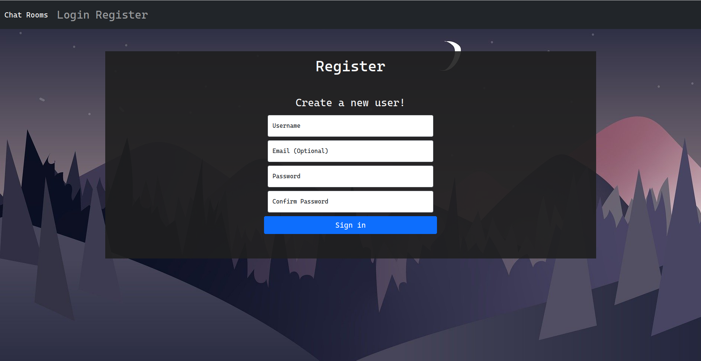
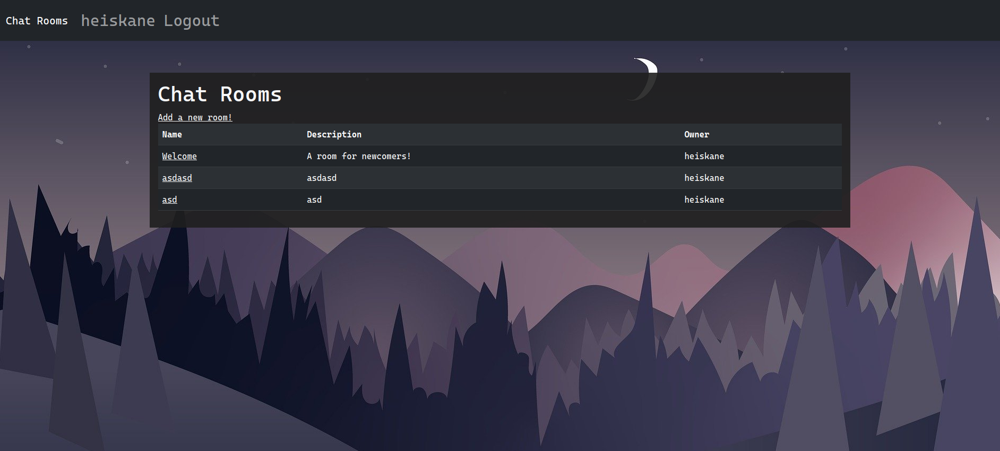
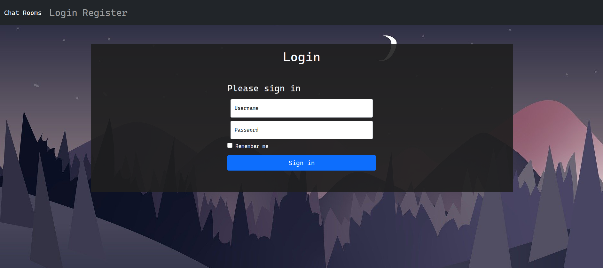

# Simple Chat Rooms

This is my final project for the python flask course by [Tero Karvinen](https://terokarvinen.com/2021/python-web-service-from-idea-to-production/)

The main idea is to have a chat room application where authenticated users can create new rooms and send messages in those rooms.

[Live demo](http://mypythonproject.rocks/chat_rooms)

